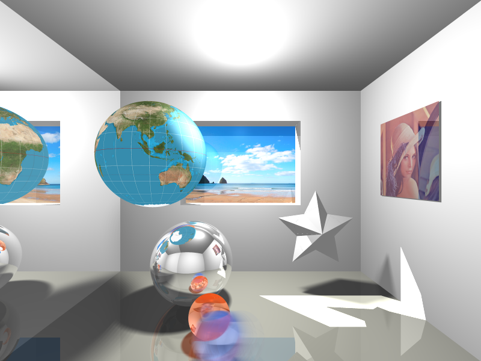

# 컴퓨터 그래픽스 - 숙제5

2015 봄 학기  
RayTracer  
2009-11744 심규민



## 구현된 기능 설명

모든 기능을 하나의 씬에 담았다.
해당 이미지는 위에 보이는 이미지이며, `/image/rendered_all.png`에 있다.

상단의 이미지는 soft shadow를 위해 49개의 point light가 사용 되었고, anti-aliasing을 위해 픽셀당 25번 sampling 하였으며, motion blur를 위해 20 frame을 그려서 만들었다. Intel Core i5-4670에서 3개의 thread를 사용하였으며, 약 3일 소요 되었다.

1. **Ray tracing spheres**  
씬 내에 총 네 개의 sphere를 그렸다. 각각은 이미지의 위에서부터 지구본, 거울 공, 빨간 유리 구슬, 파란 유리 구슬이다.  
중심점과 반경만을 가지고 있는 implicit function으로 놓고 ray와 교점을 계산하였다.

2. **Ray tracing polygons**  
씬에는 주로 rectangle을 그렸지만, 어떠한 형태의 simple polygon도 그릴 수 있도록 하였다.
창문이 뚫려 있는 벽은 대각선 방향으로 잘라서 6각형 두 개로 구성되어 있다.  
먼저 polygon을 포함한 평면과 ray의 교점을 구하고, 그 점에서 평면 상에서 ray를 쏴서 내부/외부 판단을 하였다.

3. **Recursive reflection**  
씬의 (이미지 기준으로) 왼쪽 벽면은 전체가 거울로 되어 있고, 거울 공, 매끈한 바닥과 recursive 반사 하는 것을 볼 수 있다.  
Material property로 반사율을 지정하여, 반사된 ray에 의한 color intensity에 반사율을 곱하여 누적해주었다.
반사된 ray가 이동한 거리에 대한 attenuation은 적용하지 않았다.
Recursive 깊이는 5로 제한하였다.

4. **Recursive refraction**  
빨간 유리 구슬, 파란 유리 구슬에서 recursive 굴절을 볼 수 있다.
거울 공에 비쳐 보이는 상과 다르게 유리 구슬에서는 굴절되어 뒤집한 상을 볼 수 있다.  
Material property로 투과율와 굴절률을 지정하여, 굴절된 ray에 의한 color intensity에 투과율을 곱하여 누적해주었다.
굴절된 ray가 이동한 거리에 대한 attenuation은 적용하지 않았다.
Recursive 깊이는 5로 제한하였다.

5. **Phong illumination**  
씬의 모든 곳에서 살펴볼 수 있다.
씬에 두 개의 광원이 있는데, 하나는 천장에 point light이고 다른 하나는 바깥에서 들어오는 directional light이다.
천장에서 specular reflection을 볼 수 있고, 각도에 따라 달라지는 diffuse color를 볼 수 있다.
방 안의 sphere들이 광원과 반대쪽도 보이는 것에서 ambient color를 볼 수 있다.  
Recursive reflection과 refraction의 마지막 단계에서 항상 phong illumination이 되도록 하였다. Point light에는 attenuation을 적용하였고, directional light는 attenuate 되지 않게 하였다.

6. **Importing geometry files (STL)**  
STL 모델 파일을 불러올 수 있게 하였다.
씬에서 보이는 별 모양의 모델이 `/RayTracer/Resources/star.stl` 파일을 불러와서 그린 것이다.  
Polygon이 구현되어 있기 때문에 polygonal mesh를 쉽게 그려줄 수 있었다.
다른 stl 파일도 불러와서 그려 볼 수 있게 하였다.

7. **Exporting image files (PNG)**  
렌더링 된 이미지를 원하는 위치에 PNG 파일로 저장할 수 있게 하였다.
위에 보이는 이미지도 이 기능을 이용하여 뽑은 것이다.

8. **Texture mapped spheres and polygons**  
씬에서 지구본과 (이미지 기준으로) 오른쪽 벽면의 액자 사진에 texture를 입혔다.
각 texture 파일은 `/RayTracer/Resources/WorldMap.png`, `/RayTracer/Resources/Lenna.png`에 있다.
창문 바깥에 해변 풍경도 texture가 입혀진 polygon을 창 밖에 위치시켜 만든 것이다.
해당 texture 파일은 `/RayTracer/Resources/Beach.png`에 있다.

9. **Soft shadows**  
방 안의 광원에서 나온 빛에 의한 그림자는 soft shadow가 생기도록 하였다.
바깥에서 들어오는 햇빛에 의한 창문틀 그림자와 다른 그림자들을 비교해보면 볼 수 있다.  
구현은 point light를 격자 형태로 여러 개 배치하여 흉내 내었다.
옵션으로 껐다 켰다 할 수 있게 하였다.

10. **Motion blur**  
씬에서 파란 구슬이 왼쪽으로 일정하게 감속하며 이동하는 것을 표현하였다.  
위치를 조금씩 이동 시키면서 여러 번 렌더링 하여 합쳐 평균을 내도록 구현하였다.
옵션으로 껐다 켰다 할 수 있게 하였다.

11. **Anti-aliasing**  
이미지에서 모든 경계 선을 보면 적용된 것을 알 수 있다.
특히 sphere의 실루엣이나 사선에서 잘 보인다.  
구현은 super sampling 하였다.
옵션으로 껐다 켰다 할 수 있게 하였다.

12. **Parallel processing**  
Multicore system에서는 core의 개수에 따라 씬을 분할하여 병렬처리 하였다.
대략 thread의 수에 비례하여 성능이 향상 되었다.
옵션으로 껐다 켰다 할 수 있게 하였다.

## 실행, 조작, 설정 방법

### 실행

먼저, 다음의 환경을 갖춘다.

* Windows >= 7
* .NET Framework >= 4.5
* Visual Studio >= 2012
* Git (for getting the source code)

다음과 같이 Github에서 코드를 가져온다.

```bash
git clone -b ray-tracer --depth 1 https://github.com/sim0629/graphics.git
cd graphics
```

또는, zip 파일의 압축을 푼다.

```bash
unzip hw5.zip -d graphics
cd graphics
```

Visual Studio로 `/RayTracer.sln`을 연다.

`Ctrl` + `F5`를 눌러 실행한다.

### 조작

각 메뉴와 그 기능은 다음과 같다.

* **File**
  * **Import .stl**  
    씬에 추가 할 STL 파일을 지정한다.
    파일을 선택할 경우 하단의 상태 바에 파일 경로가 나타나고, 취소하면 사라진다.
  * **Export .png**  
    현재 렌더링 된 이미지를 PNG 파일로 저장한다.
* **Render**
  * **Run**  
    현재 설정으로 렌더링을 시작한다.
    하단의 상태 바에 걸린 시간과 진행률이 표시된다.
  * **Multi-threading**  
    체크 해두면 렌더링을 여러 thread로 한다.
  * **Soft shadow**  
    체크 해두면 point light가 area light처럼 동작 한다.
  * **Motion blur**  
    체크 해두면 씬에 움직임을 준다.
  * **Anti-aliasing**  
    체크 해두면 super sampling 한다.

### 설정

몇 가지 설정값을 바꿔서 테스트 해볼 수 있다.
`/RayTracer/Config.cs` 파일에서 바꿀 수 있는 상수들은 다음과 같다.

* `imageWidth`: 렌더링할 이미지의 너비
* `imageHeight`: 렌더링할 이미지의 높이
* `NumberOfWorkers`: Multi-threading에서 쓸 thread의 개수
* `SoftShadowDegree`: Soft shadow 정도 `(Area light에 들어갈 point light의 개수) = (2 * SoftShadowDegree + 1)^2`
* `AntiAliasingDegree`: Anti-aliasing 정도 `(Super sampling 수) = (2 * AntiAliasingDegree + 1)^2`
* `MotionBlurDuration`: Motion blur를 위한 시간 간격

이 외에 `/RayTracer/Model/Camera.cs` 파일에서 카메라의 position, reference point, up vector, field of view, near plane distance 등을 변경할 수 있다.

(문서 끝)
