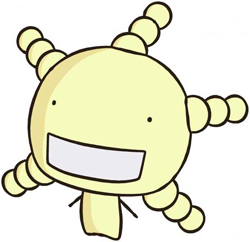

# 컴퓨터 그래픽스 - 숙제1

2015 봄 학기
계층 모델 만들기
2009-11744 심규민

[TOC]

## 목표

본 숙제의 목표는 OpenGL로

1. matrix stack을 사용하여
2. 3-level 이상의 계층 구조를 갖는
3. 3D 모델을 만들어
4. 재밌게/멋있게
5. animate 하는

것이다.

## 개발 환경

* Python 2.7
* PyOpenGL
* numpy

자세한 파이썬 패키지 버전은 코드 저장소 내의 `/requirements.txt`에 명시되어 있다.

## 실행 및 조작 방법

### 실행

다음의 명령어를 통해 소스 코드를 내려받아 실행할 수 있다.

```bash
git clone https://github.com/sim0629/graphics.git
cd graphics
pip install -r requirements.txt
python hierarchy
```

### 조작

다음의 네 가지 키로 모델을 돌려볼 수 있다. 카메라가 움직이는 것이 아니다.

* `h, l`: 좌우(`y`축)로 돌려보기
* `j, k`: 상하(`x`축)로 돌려보기

## 모델

### 소개

모델은 TV 애니메이션 *모야시몬(もやしもん)*에 등장하는 캐릭터 *A.오리재(Aspergillus oryzae, 이하 오리재)*를 모방하였다. *오리재*는 다음과 같이 생겼다.



*오리재 from http://blog-imgs-43-origin.fc2.com/t/a/k/takamishouten/middle_1208577157.jpg*

### 구성

여기서 모방한 *오리재* 모델의 계층적 구성은 다음과 같다. 괄호 안은 코드 상의 클래스 이름이다.

* **오리재(Oryzae)**는 *머리*와 *몸통*으로 구성되어 있다.
  * **머리(Head)**는 원점에 위치한 구이다.
    정수리는 `+y`방향이며, 얼굴은 `+z`방향에 있는 면이다.
    두 *눈*과 *입*, 그리고 *머리카락*으로 구성되어 있다.
    * **머리카락(Hair)**은 뒷통수에 방사형으로 달린 다섯 가닥의 구 연결체이다.
      세 개의 구가 일렬로 연결되어 있다. 각 구는 *머리카락 마디(HairNode)*이다.
      * **머리카락 마디(HairNode)**는 머리카락을 구성하는 구이다.
        기본적으로, 머리의 바깥쪽 방향으로 서로 이어져 있다.
    * **눈(Eye)**은 얼굴의 윗부분 양쪽에 위치한 작은 구이다.
    * **입(Mouth)**은 아랫부분 가운데에 위치한 타원 기둥이다.
  * **몸통(Body)**은 원점에서 `-y`방향에 위치한 사각뿔대이다.
    팔은 생략한다.

### 움직임

*오리재*는 다음과 같이 움직일 수 있다.

* *머리*를 좌우로 갸우뚱(rolling)한다.
* *몸통*의 아래 부분이 넓어지거나 좁아진다.
* 각 *머리카락 마디*가 얼굴의 반대 방향으로 휘어(tilting)진다.

## 구현 설명

### 파일 구조

이번 숙제와 관련된 코드는 `/hierarchy/`에 위치해 있다. 각 파일은 다음과 같은 역할을 한다.

* `__init.py__`: 비어 있다.
* `__main.py__`: glut window를 띄우고, 모델을 만들어 보여주며 키 입력을 받는다.
* `oryzae.py`: 모델의 (그리는 방법을 포함한) 정의가 들어있다.

### World

* 카메라는 `(0,0,0)`에서 `-z` 방향을 바라본다.
* 모델은 `(0,0,-4)`에 놓여 있다.
* 광원은 `(1,1,1)`에 놓여 있다.

### 클래스

#### `Model`

모델의 기반 클래스로서, 모델의 각 부분은 모두 이 클래스를 상속한다. 다음은 이 클래스의 코드 전체이다.

```python
  class Model:
    def _draw(self):
      pass
    def render(self):
      glPushMatrix()
      self._draw()
      glPopMatrix()
    def update(self):
      pass
```

matrix stack을 편리하게 사용하기 위하여, `_draw`를 `push`, `pop`으로 감싸는 `render`를 정의 하였다. 각 모델에서는 자기 자신을 보여주고 자신의 하위 모델들을 render하는 식으로 _draw를 재정의 하였다.

모든 모델들의 목록과 포함 관계는 다음과 같다.

* `Oryzae`
  * `Head`
    * `Hair`
      * `HairNode`
        * `HairNode`
          * `HairNode`
    * `Eye`
    * `Mouth`
  * `Body`

움직임을 표현하기 위해, 한 프레임이 지날 때마다 불릴 `update`도 구현하였다.

#### `Animation`

모델에 움직임을 주기 위한 보조 클래스로서, `update`가 불릴 때마다 `[0.0, 1.0]` 범위를 `speed` 단위로 왕복하는 속성(`ratio`)을 가지고 있다.

움직임이 필요한 모델에서, 원하는 `speed`를 주고 `Animation` 객체를 하나 생성하여 가지고 있고, 모델의 `update` 내에서 `Animation` 객체의 `ratio`를 이용하여 모델의 위치나 방향을 결정하는 수치를 조정하고, `Animation` 객체를 `update`한다.

### 특이 사항

* 구는 `glutSolidSphere`를 이용하여 그렸다.
* *입*을 그리기 어려워서, 얇은 타원기둥으로 흉내 내었다. `gluCylinder`를 이용하였다.
* *머리카락*은 *머리카락 마디*의 연결 리스트(linked list)로 표현 하였다.

## 데모

아래 url에서 데모 영상을 확인할 수 있다.

https://youtu.be/PUFbK8JfrKU
