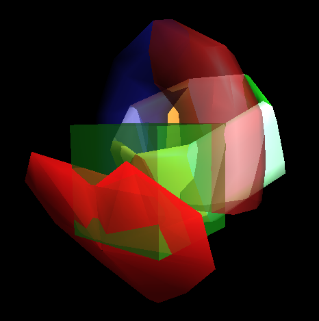

# 컴퓨터 그래픽스 - 숙제4

2015 봄 학기  
Shading  
2009-11744 심규민

## 1. 실행

먼저, 다음의 환경을 갖춘다.

* Linux (or Mac OS X)
* Python 2.7
* pip (for installing python packages)
* Git (for getting the source code)
* freeglut3

다음과 같이 Github에서 코드를 가져온다.

```bash
git clone https://github.com/sim0629/graphics.git
cd graphics
git checkout hw4
```

또는, zip 파일의 압축을 푼다.

```bash
unzip hw4.zip -d graphics
cd graphics
```

다음 명령어로 필요한 파이썬 패키지를 설치한다.
이 명령어는 환경에 따라 `sudo`로 실행해야 할 수도 있다.

```bash
pip install -r requirements.txt
```

다음 명령어로 실행한다.

```bash
python shading
```

`esc`키를 눌러 종료할 수 있다.

## 2. 조작

조작법은 3D Viewer와 동일하다.

| 동작         | 방법                              |
|--------------|-----------------------------------|
| Rotation     | 마우스 드래그                     |
| Translation  | `shift`키를 누른 채 마우스 드래그 |
| Dolly in/out | `w`/`s`키                         |
| Zoom in/out  | `d`/`a`키                         |
| Show all     | `space`키                         |
| Seek         | `ctrl`키를 누른 채 마우스 클릭    |

## 3. 구성



Scene은 반지, 상자, 말굽자석의 세 가지 object로 구성되어 있다.
Swept Surface에서 디자인한 하트가 달린 불투명한 반지에,
투명한 상자와 말굽자석이 겹쳐있는 형태이다.

## 4. 설명

### Material Properties

각 부분별로 나타내고자한 material은 다음과 같다.

* 반지에 달린 반투명한 하트: Ruby
* 반지의 불투명한 링: Gold, Silver, Bronze, Pearl, Emerald, Jade (하트의 위에서 바라보았을 때 시계 방향으로)
* 반투명한 상자: 녹색 플라스틱(Cube)
* 반투명한 말굽자석: 빨간색, 파란색 플라스틱(North, South)

각 material에 대한 Phong illumination coefficient는 `/shading/material.py`에 구현된 바와 같다.

```python
  if name == 'ruby':
    ambient = (0.1745, 0.01175, 0.01175, 0.8)
    diffuse = (0.61424, 0.04136, 0.04136, 0.8)
    specular = (0.727811, 0.626959, 0.626959, 1.0)
    shininess = 0.6
  elif name == 'gold':
    ambient = (0.24725, 0.1995, 0.0745, 1.0)
    diffuse = (0.75164, 0.60648, 0.22648, 1.0)
    specular = (0.628281, 0.555802, 0.366065, 1.0)
    shininess = 0.4
  elif name == 'silver':
    ambient = (0.19225, 0.19225, 0.19225, 1.0)
    diffuse = (0.50754, 0.50754, 0.50754, 1.0)
    specular = (0.508273, 0.508273, 0.508273, 1.0)
    shininess = 0.4
  elif name == 'bronze':
    ambient = (0.2125, 0.1275, 0.054, 1.0)
    diffuse = (0.714, 0.4284, 0.18144, 1.0)
    specular = (0.393548, 0.271906, 0.166721, 1.0)
    shininess = 0.2
  elif name == 'pearl':
    ambient = (0.25, 0.20725, 0.20725, 1.0)
    diffuse = (1.0, 0.829, 0.829, 1.0)
    specular = (0.296648, 0.296648, 0.296648, 1.0)
    shininess = 0.088
  elif name == 'emerald':
    ambient = (0.0215, 0.1745, 0.0215, 1.0)
    diffuse = (0.07568, 0.61424, 0.07568, 1.0)
    specular = (0.633, 0.727811, 0.633, 1.0)
    shininess = 0.6
  elif name == 'jade':
    ambient = (0.135, 0.2225, 0.1575, 1.0)
    diffuse = (0.54, 0.89, 0.63, 1.0)
    specular = (0.316228, 0.316228, 0.316228, 1.0)
    shininess = 0.1
  elif name == 'cube':
    ambient = (0.0, 0.0, 0.0, 0.5)
    diffuse = (0.1, 0.65, 0.1, 0.5)
    specular = (0.45, 0.55, 0.45, 0.5)
    shininess = 0.25
  elif name == 'north':
    ambient = (0.0, 0.0, 0.0, 0.5)
    diffuse = (0.65, 0.1, 0.1, 0.5)
    specular = (0.55, 0.45, 0.45, 0.5)
    shininess = 0.25
  elif name == 'south':
    ambient = (0.0, 0.0, 0.0, 0.5)
    diffuse = (0.1, 0.1, 0.65, 0.5)
    specular = (0.45, 0.45, 0.55, 0.5)
    shininess = 0.25
  else:
    ambient = (0.1, 0.1, 0.1, 1.0)
    diffuse = (0.9, 0.9, 0.9, 1.0)
    specular = (0.0, 0.0, 0.0, 1.0)
    shininess = 0.0
  glMaterial(GL_FRONT_AND_BACK, GL_AMBIENT, ambient)
  glMaterial(GL_FRONT_AND_BACK, GL_DIFFUSE, diffuse)
  glMaterial(GL_FRONT_AND_BACK, GL_SPECULAR, specular)
  glMaterial(GL_FRONT_AND_BACK, GL_SHININESS, shininess * 128.0)
```

http://devernay.free.fr/cours/opengl/materials.html 를 참조하였다.

### Depth Ordering Algorithm

BSP tree를 사용하였다.
Scene을 불러올 때 BSP tree를 만들어 놓고,
depth test를 끈 채로,
alpha blend를 켜고,
보는 위치에 따라 순서대로 mesh를 그리도록 하였다.

Mesh는 삼각형만으로 구성되게 하였으며,
삼각형 중 하나를 무작위로 골라서
이 삼각형을 포함하는 평면을 기준으로
나머지 삼각형들을 두 그룹으로 나눈다.
이 작업을 재귀적으로 반복하여 BSP tree를 구성했다.

삼각형을 평면으로 자르는 알고리즘은 다음과 같다.
우선 삼각형의 세 꼭짓점이
평면의 왼쪽에 있는지,
평면에 포함되는지,
평면의 오른쪽에 있는지 판별한다.
모두 같은 쪽에 있는 경우, 자르지 않고 위치가 결정된다.
어느 하나가 평면에 포함되는 경우,
나머지 둘이 같은 쪽에 있을 때에는 자르지 않고 위치가 결정되고,
나머지 둘이 다른 쪽에 있을 때에는 삼각형 두 개로 잘린다.
어느 것도 평면에 포함되지 않는 경우,
삼각형 하나와 사각형 하나로 잘린다.

카메라의 위치에 따라 BSP tree를 순회하여
가장 먼 삼각형부터 순서대로 그렸다.

자세한 것은 `/shading/bsp.py`에 구현되어 있다.

### Lighting Configuration

광원은 두 개가 있다.
0번 광원은 directional light이고,
1번 광원은 spot light이며,
두 광원 모두 흰색 빛이다.

초기에 카메라는 `+z`방향에서 원점을 바라보게 되어 있는데,
directional light는 `(1, 1, 1, 0)`에 위치해 있어서
대각선 방향으로 내리쬐고 있으며,
spot light는 `(0, 0, 1, 1)`에 위치하여
원점을 바라보고 있어서
반지의 하트 부분을 강조해준다.

각 광원에 대한 coefficient는 `/shading/__main__.py`에 구현된 바와 같다.

```python
  glEnable(GL_LIGHT0)
  glLight(GL_LIGHT0, GL_AMBIENT, (1.0, 1.0, 1.0, 1.0))
  glLight(GL_LIGHT0, GL_DIFFUSE, (1.0, 1.0, 1.0, 1.0))
  glLight(GL_LIGHT0, GL_SPECULAR, (1.0, 1.0, 1.0, 1.0))
  glLight(GL_LIGHT0, GL_POSITION, (1.0, 1.0, 1.0, 0.0))

  glEnable(GL_LIGHT1)
  glLight(GL_LIGHT1, GL_AMBIENT, (0.0, 0.0, 0.0, 1.0))
  glLight(GL_LIGHT1, GL_DIFFUSE, (1.0, 1.0, 1.0, 1.0))
  glLight(GL_LIGHT1, GL_SPECULAR, (1.0, 1.0, 1.0, 1.0))
  glLight(GL_LIGHT1, GL_POSITION, (0.0, 0.0, 1.0, 1.0))
  glLight(GL_LIGHT1, GL_SPOT_CUTOFF, 45.0)
  glLight(GL_LIGHT1, GL_SPOT_DIRECTION, (0.0, 0.0, 0.0, 1.0))
  glLight(GL_LIGHT1, GL_SPOT_EXPONENT, 2.0)
```

(문서 끝)
